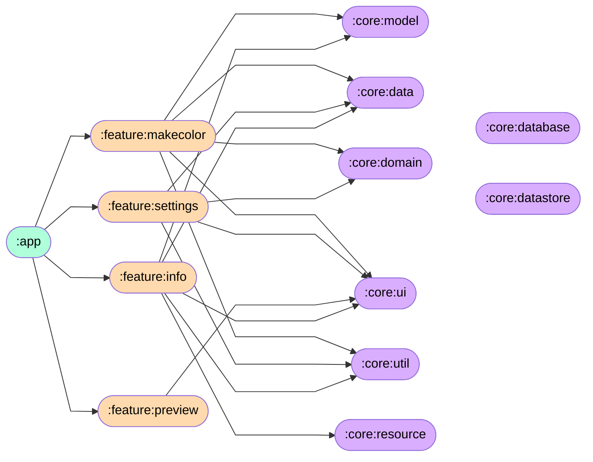

[](https://https://github.com/kosenda/MultiColorPicker)

## 概要

Google Playで公開しているアプリ「マルチカラーピッカー」のソースになります。

https://play.google.com/store/apps/details?id=kosenda.makecolor

## アプリについての簡単な説明
- 様々な方法で色を作成できることだけでなく、保存や比較もできるアプリ
- アーキテクチャはMVVM
- 13言語対応
- 色についてはRGB, CMYK, HSV, HEXに対応


## 今後特にしていきたいこと
- マルチモジュール対応
- テストの追加

## アプリを初めて起動するとき
#### `local.properties`に以下を追記してください
```
adApplicationId=ca-app-pub-3940256099942544~3347511713
adUnitId=ca-app-pub-3940256099942544/6300978111
```


## 使用している代表的なライブラリ  
|名前|簡単な説明|
|:--|:--|
|Jetpack Compose|UIアプリ開発ツールキット|
|Material3|デザイン|
|kotlinx serialization|シリアライザー|
|Preferences DataStore|永続化データ|
|Room|データベース|
|Truth|アサーション|
|Hilt|依存性注入|
|Timber|ログ出力|
|compose-color-picker|カラーピッカー|
|palette-ktx|パレットAPI|
|play-services-ads|Google AdMob|
|play-services-oss-licenses|ライセンス|
|ui-text-google-fonts|ダウンロード可能なフォント|
|ktlint|フォーマッター|
|Circle Ci|CI/CD|
|danger|プルリク時に警告|

## モジュール構成
#### ⚠️ :feature と :core 内の依存関係は省略しています


## スクリーンショット
<details>
<summary>主要画面</summary>

|説明|ダークモード|ライトモード|
|---|---|---|
|色作成（ピッカー）|||
|色作成（シークバー）|||
|色作成（テキスト）|||
|色作成（写真）|||
|色作成（混色）|||
|色作成（ランダム）|||
|データ一覧|||
|分割色作成|||
|グラデーション作成|||
|設定|||
</details>

<details>
<summary>その他画面</summary>

|説明|画面|
|---|---|
|インフォ||
|色選択||
|グラデーション||
|単色||
|カテゴリー詳細||
</details>

## アプリ内のデフォルトカラーデータについて
#### 以下からデータを設定しました
- JIS慣用色名 『フリー百科事典ウィキペディア（Wikipedia）』  
最終更新: 2021年3月24日 (水) 06:53(UTC)  
URL: https://ja.wikipedia.org/wiki/JIS慣用色名  

- JIS安全色 『フリー百科事典ウィキペディア（Wikipedia）』  
最終更新: 2021年2月5日 (金) 00:19(UTC)  
URL: https://ja.wikipedia.org/wiki/JIS安全色  

- ウェブカラー 『フリー百科事典ウィキペディア（Wikipedia）』   
最終更新: 2020年11月20日 (金) 08:15(UTC)  
URL: https://ja.wikipedia.org/wiki/ウェブカラー  

- X11の色名称 『フリー百科事典ウィキペディア（Wikipedia）』  
最終更新: 2021年5月31日 (月) 00:18(UTC)  
URL: https://ja.wikipedia.org/wiki/X11の色名称  

- コピック  
最終更新: 2021年5月10日  
URL: https://copic.jp/about/color-system/  

